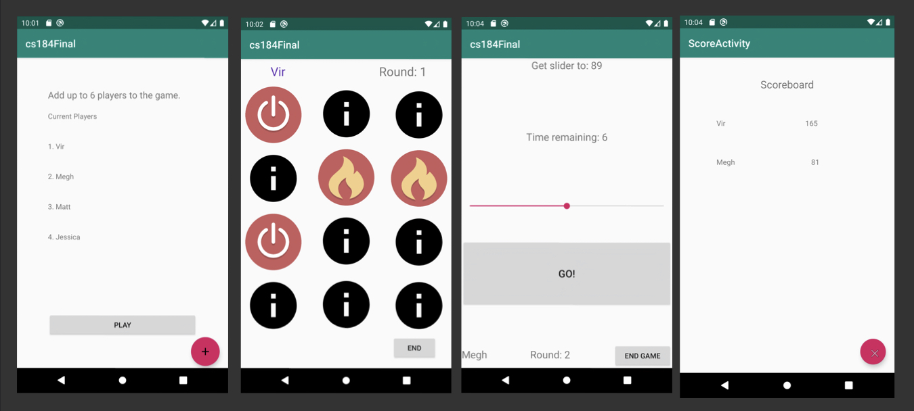

# Android Mini Games 

This app if for groups of friends wanting to pass time together by playing mini-games and competing with each other. The app is designed to have multiple players and players pass the phone around and compete with each other to see who gets a better score in a shorter amount of time.

This app was made using Java and Android Studio with Megh Shah for CS184 Mobile Application Development at UCSB. 
